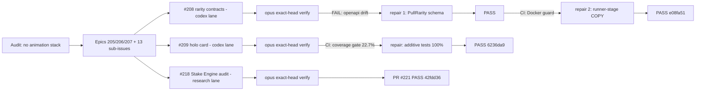

# 2026-07-26

## Session 2 — Game-feel audit, casino roadmap epics, wave-1 delivery

> Note: another session (PR #203 / `solana-depth-phase2`) may append its own entry for this date; keep both on merge.

### System flow (wave-1 delivery loop)

### Affected components

- GitHub project planning (epics #205 #206 #207, issues #208–#220)
- `packages/contracts`, `apps/api`, `apps/api/Dockerfile`, `apps/docs/public/openapi.yaml` (PR #223)
- `apps/app/app/components/holo-card/`, `apps/app/app/dev/holo-card/` (PR #224)
- `docs/competitor-audit/stake-engine-audit.md` (PR #221)

### What was done

- [x] Audited game-feel/animation capability: **no animation library, no WebGL/canvas, no sound/haptics anywhere**; only the Duel Arena has a CSS flip; Flip/Crash previews reveal with a hard cut; rarity unmodeled in frontend before PR #203.
- [x] Created roadmap as epics in house PRD style: #205 (casino-grade reveal choreography, 7 children #208–#214), #206 (PixiJS rendering SDK + theme packs, children #215–#217), #207 (DailyDraft Engine RGS vs Stake Engine, children #218–#220).
- [x] Wave-1 parallel delivery: PR #221 (#218 audit, PASS), PR #223 (#208 rarity contracts, PASS after 2 repair cycles), PR #224 (#209 holo card, PASS after 1 coverage repair). All three left at the human merge gate.
- [x] Repo-public preflight: gitleaks over 232 commits → 17 findings, **all false positives** (Solana base58 test fixtures, placeholder strings, SQL constraint names); only `.env.example` ever committed. License choice + visibility flip left to Vincent.

### Key decisions

1. **Rarity semantics**: PR #203's `pull-rarity.ts` is canonical — `common|uncommon|rare|chase` from committed `insuredValue` at $10/$50/$150 floors, presentation-only, never in the result hash. #208 promoted it into `packages/contracts`; follow-up: `pull-rarity.ts` re-exports from contracts after #203 merges.
2. **Engine repo placement**: engine + themes stay in this monorepo (`packages/engine`, `packages/themes`); extraction to a public SDK repo only on first external consumer. No separate games monorepo/API — RGS stays in `apps/api` (deploy boundary ≠ repo boundary). Recorded on #206/#207.
3. **Tech stack ruling**: Tier 1 DOM juice (Motion + CSS holo + confetti + howler) → Tier 2 PixiJS v8 SDK (industry standard; Stake Engine's own web SDK is Pixi) → Tier 3 RGS. Three.js only for cinematic set pieces, never the engine.
4. **Wedge vs Stake Engine** (from PR #221): Stake's third-party surface has zero documented provable fairness; DailyDraft's commit-reveal + hash-pinned proofs + future Solana anchoring (Merkle-batched at commit and settle) is the differentiator, packaged as a `dailydraft.rgs-proof.v1` envelope.

### Mistakes and fixes

- Codex plugin (`codex-rescue`) sandbox cannot write to worktrees outside the session project root → lanes relaunched via raw `codex exec` with `-C <worktree>`; worked. The plugin wrapper is also forwarding-only (cannot poll its own jobs).
- Codex background tasks self-claim "verifier PASS" — never accepted; every head got a real opus review (which caught real issues twice: OpenAPI `additionalProperties: false` drift, and relied on CI catching the Docker runner-stage gap + changed-coverage gate).
- Codex tried the delivery-loop planner call via a not-logged-in Claude profile (`.claude-shipshitdev`) mid-task; degraded correctly. Relaunched lanes were told planning was already satisfied.

### Files changed (this session's branch)

- `.agents/sessions/2026-07-26.md` (this entry)
- `.agents/memory/game-engine-roadmap.md` (new durable decision record)

### Next steps

- Vincent: merge PRs #221, #223, #224; decide license; flip repo public.
- Wave 2 after merges: #210 choreography module (+Motion dep), #215 Pixi spike; then #211 (duel migration), #212 (celebrations, needs #208), #213 (audio), #214 (e2e proof).
- Pending chip: response-shape drift test against `openapi.yaml` (gap found in PR #223 review).
