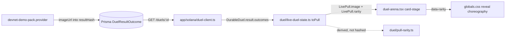
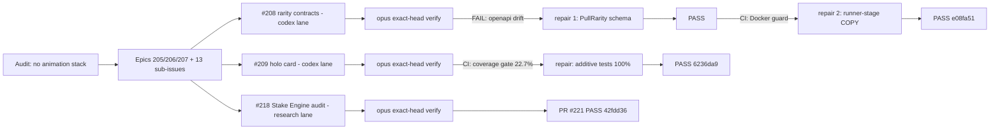
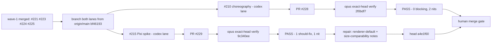

# 2026-07-26

## Session 1 — Arena payoff reveal (games UX/Solana plan, Phase 1)

Branch: `claude/games-uxui-solana-375946` (worktree `vigilant-bohr-9b2f1c`). Scope: `apps/app` only.

### System flow

### Affected components

- **Frontend only.** `apps/app` — Solana client types, duel state mapping, arena markup, global CSS, e2e fixtures/journeys/snapshots.
- **No API, contract, schema, or escrow change.** The rarity tier is derived client-side from the `insuredValue` the API already committed, so the commit-reveal `resultHash` is untouched and every already-settled duel renders correctly.

### What was done

- [x] Wire `imageUrl` through to the live duel arena
- [x] Add value-derived rarity tiers (`common | uncommon | rare | chase`)
- [x] Build the reveal choreography (pack rip, seam split, holo sheen, tier burst)
- [x] Update fixtures, unit tests, and visual snapshots

### Key decisions

- **Rarity is presentation-only, derived from committed value.** Floors at $10 / $50 / $150. Adding a rarity field server-side would have changed the canonical hash inputs and invalidated existing proofs; `insuredValue` is already inside the hash, so deriving from it is free and retroactive.
- **Winner emphasis is a scale/glow pop, not a numeric count-up.** The plan called for a count-up. `journeyTestIds.pullValue[side]` is asserted as exact text in Playwright, and a running count-up makes that text transiently wrong — guaranteed flake. Deviation is intentional and recorded.
- **Pack back art drawn in CSS rather than fetched.** The remote cardback URL has 404'd since the repo's first commit, so the pre-reveal card rendered as flat colour. A local foil lattice also removes a network round trip from the one screen where latency is most visible.
- **Reveal payoff asserted structurally, not by pixels.** Playwright's `unstableVisuals()` masks every `img`, and `<Image fill>` spans the whole `.pull-shell`, so the reveal card is a solid rectangle in snapshots. Added DOM assertions on `.pull-image` alt text and `.pull-rarity` label instead. Masking stays — the fixture art is a genuinely remote, network-flaky URL.
- **Reduced motion extends the existing block.** Every new animation was added to the existing `@media (prefers-reduced-motion: reduce)` selector lists rather than introducing a second pattern.

### Files changed

| File | Change |
|---|---|
| `apps/app/app/solana/duel-client.ts` | Added `imageUrl?: string \| null` to `result.outcomes[]` — the root defect |
| `apps/app/app/duel/pull-rarity.ts` | New pure tier mapper + labels (presentation only) |
| `apps/app/app/duel/pull-rarity.test.ts` | New — boundaries, other decimal precisions, jargon sweep |
| `apps/app/app/duel/live-duel-state.ts` | `toPull()` maps image + derives rarity |
| `apps/app/app/duel/live-duel-state.test.ts` | Image carried through, null-art fallback, rarity derivation |
| `apps/app/app/duel-arena.tsx` | `data-rarity` on `.card-stage`; `.pack-art`, `.pull-sheen`, `.pull-burst`, `.pull-rarity` |
| `apps/app/app/globals.css` | Rarity tokens, foil lattice, sheen sweep, burst ring, 8-stop pack rip, seam split, reduced-motion coverage |
| `apps/app/e2e/fixtures/journey-fixture.ts` | `#settledDuel` outcomes gained `imageUrl` |
| `apps/app/e2e/visual-states.journey.ts` | Four DOM assertions for the masked reveal |
| `apps/app/e2e/visual-states.journey.ts-snapshots/*.png` | 6 baselines regenerated |
| `.gitignore` | Added `*.tsbuildinfo` (build output was untracked and unignored) |

### Mistakes and fixes

- **Misdiagnosed "`.pack-art` isn't rendering."** Bumping foil alphas produced byte-identical crops and no snapshot regeneration. Suspected the div was missing or covered; verified markup, container CSS freshness, and the snapshot stylesheet — all innocent. Real cause: Playwright's default per-pixel `threshold: 0.2` (YIQ) treats a ~4/6/2 RGB delta as "not different", so the comparison passed and `--update-snapshots` left the baseline alone. The lattice was rendering, just imperceptibly. Resolved by raising opacity to a clearly visible 0.85.
- **Baseline/CSS drift.** A later dial-back to `opacity: 0.72` again fell under the diff threshold, so the committed PNG would have reflected 0.85 while the CSS said 0.72. Reverted the CSS to 0.85 so source and baseline match exactly.
- **Design-system contract failure.** The new `.pull-rarity` badge shipped at `font-size: 10px`; `design-system-contract.test.ts` enforces ≥ 11px. Bumped to 11px.
- **`docker exec … bunx` → executable not found.** Non-login exec does not source the profile. Every container command now wraps as `bash -lc 'export PATH="$HOME/.bun/bin:$PATH"; …'`.
- **Two throwaway probe specs failed** — one missing the `journey` fixture destructure, one timing out because `.pack-art` only exists after the full 4-step funding flow. Abandoned in favour of the threshold diagnosis above.

### Verification

- `bun run lint` — 7/7 tasks successful
- `bun run lint:design` — 0 errors, 0 warnings
- `bun --filter @dailydraft/app typecheck` — clean
- `bun --filter @dailydraft/app test` — 223 pass, 0 fail
- Playwright `visual-states` + `keyboard-reduced-motion` in a native-arm64 `playwright:v1.61.1-noble` container — 4 passed, stable on a repeat run against the committed baselines

### Next steps

- Phase 2 — Solana depth: balance preflight, `getSignatureStatuses` confirmation tracking, transaction explorer links. Shared helpers under `apps/app/app/solana/` so Phases 3–5 consume them.
- Phase 3 — Flip / Sports Pack Gacha playable (devnet gacha provider + treasury-transfer payment path).
- Phase 4 — Card Streak / Crash playable. **Blocked on a `trustContract` policy approval**, not on code.
- Phase 5 — Fantasy Tournaments playable. Largest, externally dependent on a live oracle feed.
- **Architectural note for Phases 3–4:** `ESCROW_V2_PROGRAM_ID` is duel-shaped (two funding sides) and lives in the external `dailydraftfun/escrow` repo. Single-player modes should use a verified SPL transfer to the house treasury, checked with the existing `transaction-verifier.ts` + `transaction-monitor.service.ts`, rather than blocking on an external program redeploy.

## Session 2 — Game-feel audit, casino roadmap epics, wave-1 delivery

> Note: another session (PR #203 / `solana-depth-phase2`) may append its own entry for this date; keep both on merge.

### System flow (wave-1 delivery loop)

### Affected components

- GitHub project planning (epics #205 #206 #207, issues #208–#220)
- `packages/contracts`, `apps/api`, `apps/api/Dockerfile`, `apps/docs/public/openapi.yaml` (PR #223)
- `apps/app/app/components/holo-card/`, `apps/app/app/dev/holo-card/` (PR #224)
- `docs/competitor-audit/stake-engine-audit.md` (PR #221)

### What was done

- [x] Audited game-feel/animation capability: **no animation library, no WebGL/canvas, no sound/haptics anywhere**; only the Duel Arena has a CSS flip; Flip/Crash previews reveal with a hard cut; rarity unmodeled in frontend before PR #203.
- [x] Created roadmap as epics in house PRD style: #205 (casino-grade reveal choreography, 7 children #208–#214), #206 (PixiJS rendering SDK + theme packs, children #215–#217), #207 (DailyDraft Engine RGS vs Stake Engine, children #218–#220).
- [x] Wave-1 parallel delivery: PR #221 (#218 audit, PASS), PR #223 (#208 rarity contracts, PASS after 2 repair cycles), PR #224 (#209 holo card, PASS after 1 coverage repair). All three left at the human merge gate.
- [x] Repo-public preflight: gitleaks over 232 commits → 17 findings, **all false positives** (Solana base58 test fixtures, placeholder strings, SQL constraint names); only `.env.example` ever committed. License choice + visibility flip left to Vincent.

### Key decisions

1. **Rarity semantics**: PR #203's `pull-rarity.ts` is canonical — `common|uncommon|rare|chase` from committed `insuredValue` at $10/$50/$150 floors, presentation-only, never in the result hash. #208 promoted it into `packages/contracts`; follow-up: `pull-rarity.ts` re-exports from contracts after #203 merges.
2. **Engine repo placement**: engine + themes stay in this monorepo (`packages/engine`, `packages/themes`); extraction to a public SDK repo only on first external consumer. No separate games monorepo/API — RGS stays in `apps/api` (deploy boundary ≠ repo boundary). Recorded on #206/#207.
3. **Tech stack ruling**: Tier 1 DOM juice (Motion + CSS holo + confetti + howler) → Tier 2 PixiJS v8 SDK (industry standard; Stake Engine's own web SDK is Pixi) → Tier 3 RGS. Three.js only for cinematic set pieces, never the engine.
4. **Wedge vs Stake Engine** (from PR #221): Stake's third-party surface has zero documented provable fairness; DailyDraft's commit-reveal + hash-pinned proofs + future Solana anchoring (Merkle-batched at commit and settle) is the differentiator, packaged as a `dailydraft.rgs-proof.v1` envelope.

### Mistakes and fixes

- Codex plugin (`codex-rescue`) sandbox cannot write to worktrees outside the session project root → lanes relaunched via raw `codex exec` with `-C <worktree>`; worked. The plugin wrapper is also forwarding-only (cannot poll its own jobs).
- Codex background tasks self-claim "verifier PASS" — never accepted; every head got a real opus review (which caught real issues twice: OpenAPI `additionalProperties: false` drift, and relied on CI catching the Docker runner-stage gap + changed-coverage gate).
- Codex tried the delivery-loop planner call via a not-logged-in Claude profile (`.claude-shipshitdev`) mid-task; degraded correctly. Relaunched lanes were told planning was already satisfied.

### Files changed (this session's branch)

- `.agents/sessions/2026-07-26.md` (this entry)
- `.agents/memory/game-engine-roadmap.md` (new durable decision record)

### Next steps

- Vincent: merge PRs #221, #223, #224; decide license; flip repo public.
- Wave 2 after merges: #210 choreography module (+Motion dep), #215 Pixi spike; then #211 (duel migration), #212 (celebrations, needs #208), #213 (audio), #214 (e2e proof).
- Pending chip: response-shape drift test against `openapi.yaml` (gap found in PR #223 review).

## Session 3 — Wave-2 delivery (#210 choreography, #215 Pixi/Rive spike)

### System flow (wave-2 delivery loop)

### Affected components

- `apps/app/app/components/choreography/` (new module), `apps/app/app/games/game-mode-preview.tsx`, `apps/app/package.json`, `bun.lock` (PR #228)
- `docs/spikes/pixi-rive-spine-spike.md` (PR #229, docs-only by design)
- `.agents/memory/game-engine-roadmap.md` (this entry's companion edit)

### What was done

- [x] Both lanes dispatched in parallel via raw `codex exec -C <worktree> --sandbox workspace-write`, each with a self-contained brief, verbatim acceptance criteria, and a HARD FILE FENCE listing every path owned by concurrent PRs #203/#222.
- [x] **#210 → PR #228**: shared choreography state machine (`idle → anticipation → hold → reveal → celebrate → settled`) replacing the hard-cut reveals in Flip and Crash/Card Streak. Pure reducer + thin Motion binding + CSS module + co-located tests, mirroring the holo-card layout. Coverage independently reproduced at **95.3% lines / 86.0% branches** — matched the lane's own claim exactly. e2e criterion explicitly deferred to #214.
- [x] **#215 → PR #229**: PixiJS v8 prototype built, measured, then reverted; only the decision memo ships. Recommendation: **Pixi v8 + Rive**, with the DOM/CSS holo card as the fail-closed baseline.
- [x] Both heads verified by `opus` bound to an exact SHA with instructions to abort STALE if the head moved. Both returned PASS.
- [x] Two #229 findings repaired directly (docs-only, two paragraphs) rather than spawning a fresh lane.

### Key decisions

1. **Rive over Spine** for authored animation. Rive's runtime is MIT and therefore survives the `@dailydraft/engine` extraction trigger; Spine's is source-available with an editor-license obligation that travels with any redistributed SDK. Rive owns the pack shell, logo, masks, and state-driven beats; Pixi/app code keeps orchestration, particles, card data, sound, haptics, degradation policy. Start on Rive `canvas-lite`.
2. **Ship Pixi on WebGL first**, WebGPU behind a capability/telemetry cohort. Pixi's own guide still recommends WebGL for production.
3. **Docs-only spike design.** `scripts/changed-coverage/run.ts:143` skips files belonging to no workspace, so a root-`docs/` memo is coverage-free. This let the spike sidestep the coverage gate entirely (an uncovered throwaway prototype in `apps/app` would have failed it for zero value) *and* removed the `bun.lock` collision with the #210 lane. Prototype source is embedded as fenced blocks in the memo so it is rebuildable from the document alone.
4. **Wave 2 was not auto-merged.** "merge all" was scoped to the four PRs that existed when it was said; #228/#229 did not. Both left at the human merge gate, matching the wave-1 precedent.

### Mistakes and fixes

- Verifier flagged the memo's renderer-preference prose as readable-as-Pixi's-default. **Verified independently before writing the fix** rather than trusting the review: `pixi.js@8.19.0/lib/rendering/renderers/autoDetectRenderer.js:8` → `const renderPriority = ["webgl", "webgpu", "canvas"]`. Memo now states the WebGPU-first order is the spike's choice, not the default, and that the agreement with the WebGL-first recommendation is coincidence.
- Verifier's runtime-size nit was **narrower than stated** — provenance labels were already inline in the table; only the explicit "do not compare head to head" warning was missing (Rive = vendor-reported Brotli WASM, Spine = locally measured JS IIFE). Added just that.
- #229's PASS is bound to `9c340ee`; the two repairs moved the head to `a4e1f60`. The delta is 16 added lines in one docs file, authored by me, one factual claim source-verified. Stated plainly rather than presented as a still-bound PASS.
- Lane #210's intermediate log showed a spurious `next-env.d.ts` edit; the final 10-file diff confirmed it had been reverted before commit. File fence held on both lanes — zero overlap with #203/#222.

### Files changed (this session's branch)

- `.agents/sessions/2026-07-26.md` (this entry)
- `.agents/memory/game-engine-roadmap.md` (Rive decision resolved; WebGL-first + lazy-load recorded; new shared-choreography section)

### Next steps

- Vincent: merge PRs #228 and #229; license choice + repo visibility flip still outstanding from Session 2 (secret scan clean, nothing else blocks it).
- Wave 3 after merges: #211 (duel migration onto the choreography module — also blocked on #203/#222), #212 (rarity-scaled celebrations, depends on #210), #213 (audio + haptics), #214 (e2e proof across reduced-motion / keyboard / 390px).
- Do not touch: PR #227 (Vincent's own background task), #226, #222, #203.
