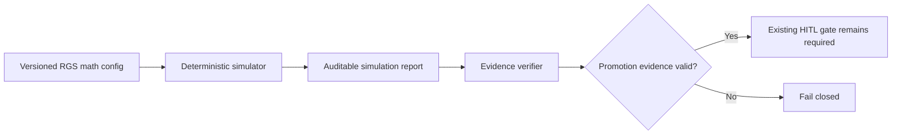

# Sessions: 2026-07-27

**Summary:** DailyDraft RGS simulation tooling (#220)

---

## Session 1: RGS Simulation Tooling

**Duration:** In progress
**Status:** In Progress

### System Flow

### Affected Components

| Layer | Components |
|---|---|
| Contracts | Versioned simulation config/report fixtures |
| Tooling | Deterministic CLI and report verifier |
| CI | Checked-in evidence promotion gate |
| Policy | Existing real-value/HITL ceiling only; no new policy decisions |

### What was done

- [x] Loaded repo memory, previous session context, issues #207/#218/#219/#220, and merged #219 evidence
- [x] Confirmed #219 merged as PR #243 at `457afec`
- [x] Resolved duplicate #220 worktree collision before code changes
- [x] Inspected three established contract/API/CLI/evidence patterns
- [x] Implemented deterministic simulation, checked-in evidence, and fail-closed promotion verification
- [x] Passed focused package/API tests, typechecks, build, lint, and exact evidence reproduction
- [x] Passed changed-code coverage and opened ready PR #246
- [x] Repaired the first exact-head review findings by binding evidence to the canonical runtime snapshot
- [ ] Reverify the repaired head and complete PR delivery

### Files changed

- `packages/rgs-simulator/` - Versioned deterministic simulation and evidence package
- `scripts/rgs-simulation*` - Bounded CLI, verification command, and tests
- `evidence/rgs-simulation/` - Reproducible Sports Pack report and manifest
- `apps/api/src/gacha/` - Shared canonical odds/fixture inputs and parity tests
- `.github/workflows/rgs-simulation.yml` - Dedicated promotion-evidence check
- `package.json`, `bun.lock` - Workspace scripts and dependency graph
- `.agents/sessions/2026-07-27.md` - Active session record

### Key decisions

- **Decision:** Treat merged PR #243 as the dependency baseline rather than duplicating closed issue #219.
  - **Context:** Current `origin/main` already contains the versioned RGS contract and #219 is closed.
  - **Rationale:** #220 must build on the landed contract and preserve its exact compatibility surface.
- **Decision:** Keep simulation evidence advisory to the existing `hitl-required` activation policy.
  - **Context:** #220 may gate promotion evidence but may not authorize real-value play.
  - **Rationale:** The epic explicitly excludes mainnet, custody, economics, payout, oracle, and jurisdiction decisions.
- **Decision:** Derive simulation config and rules hashes through `prepareGachaInventorySnapshot`.
  - **Context:** The first independent exact-head review found the initial adapter used a self-consistent synthetic hash rather than the runtime commitment.
  - **Rationale:** Evidence must replay the exact snapshot and odds commitments used by runtime Gacha rounds.

### Mistakes and fixes

- **Mistake:** A duplicate `codex/220-rgs-simulation` task was already active in another clean worktree.
  - **Fix:** Verified it had no edits, asked it to pause, and created a distinct branch in this task.
  - **Prevention:** Recheck active Codex tasks and worktree ownership before every dependent epic slice.
- **Mistake:** The first evidence adapter committed a reduced simulation input rather than the canonical runtime snapshot.
  - **Fix:** Routed the adapter through `fixtureSnapshotInput` and `prepareGachaInventorySnapshot`, added runtime outcome parity vectors, regenerated evidence, and widened CI path triggers.
  - **Prevention:** Regression evidence for a runtime commitment must call the same canonical preparation function, not reproduce a reduced hash payload.

### Verification

- `bun test packages/rgs-simulator/src scripts/rgs-simulation/core.test.ts apps/api/src/gacha/gacha-pull-odds.test.ts apps/api/src/gacha/sports-pack-gacha.fixture.test.ts`
- `bun --filter @dailydraft/rgs-simulator typecheck`
- `bun --filter @dailydraft/rgs-simulator build`
- `bun --filter @dailydraft/db db:generate`
- `bun --filter @dailydraft/api typecheck`
- `bun --filter @dailydraft/api test`
- `bun run lint`
- `bun run rgs:verify`
- `TURBO_SCM_BASE=origin/main TURBO_SCM_HEAD=HEAD bun run coverage:changed`

### Next steps

- [ ] Commit and push the verifier repair to PR #246
- [ ] Rerun changed-code coverage and monitor the new required checks
- [ ] Obtain a passing independent review on the repaired exact head
- [ ] Report #220 PR/head/checks to the orchestrator and wait for merge direction

---

**Total sessions today:** 1
