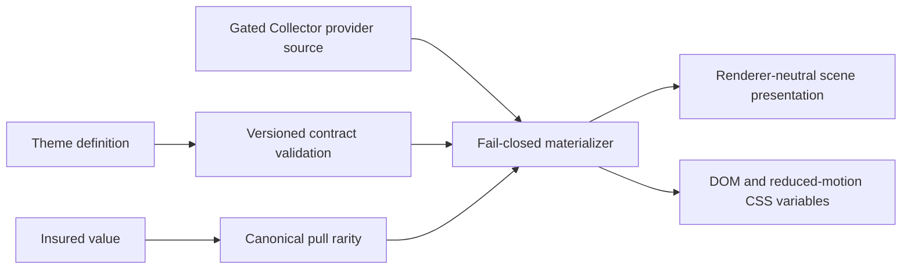

# Sessions: 2026-07-27

**Summary:** Pixi theme-pack pipeline delivery

---

## Session 1: Theme Pack Pipeline

**Duration:** ~45 minutes
**Status:** Complete

### System flow

### Affected components

| Layer | Components |
|---|---|
| Contracts | `packages/contracts/src/theme-pack.ts`, compatibility fixtures, root fixture fingerprint |
| Themes | New `packages/themes` workspace with Collector Crypt and devnet/demo definitions |
| Tooling | Workspace lockfile and package build/lint/typecheck/test scripts |
| Provider/RGS | No implementation files changed; existing gates remain intact |

### What was done

- [x] Refreshed from `origin/main` and confirmed #216 had already landed in PR #242
- [x] Added the `dailydraft.theme-pack.v1` schema and drift fixtures
- [x] Added renderer-neutral scene and DOM presentation adapters
- [x] Added a bundled devnet/demo theme
- [x] Added a Collector Crypt theme that fails closed without a production gated-source envelope
- [x] Verified focused packages and the full monorepo lint/typecheck/build gates

### Key decisions

- **Decision:** Theme definitions describe provider art slots rather than embedding Collector Crypt assets.
  - **Context:** #165 remains an explicit HITL production-promotion gate.
  - **Rationale:** The renderer cannot accidentally activate Collector art or metadata from a static fallback.
- **Decision:** Derive Collector rarity from insured value in the gated source.
  - **Context:** Rarity is presentation-only and has one canonical contract.
  - **Rationale:** Prevents theme data from drifting from the committed value model.
- **Decision:** Keep theme presentation renderer-neutral.
  - **Context:** Pixi and informative DOM/reduced-motion fallbacks must preserve the same information.
  - **Rationale:** One materialized theme can feed Pixi numeric colors and DOM CSS variables without scene-specific branching.

### Files changed

- `.agents/memory/game-engine-roadmap.md` - recorded the durable theme-pack and provider-gate boundary
- `.agents/sessions/2026-07-27.md` - documented this delivery
- `bun.lock` - registered the new workspace
- `packages/contracts/README.md` - documented the leaf theme-pack contract
- `packages/contracts/package.json` - exported and built the theme-pack entrypoint
- `packages/contracts/src/index.ts` - included theme fixtures in the compatibility fingerprint
- `packages/contracts/src/theme-pack.ts` - added schema, validation, fixtures, and source envelope
- `packages/contracts/src/theme-pack.test.ts` - added schema/drift and fail-closed tests
- `packages/themes/*` - added theme definitions, materialization, scene/DOM adapters, tests, and documentation

### Mistakes and fixes

- **Mistake:** The first fixture maps used `Object.fromEntries`, which widened exact art-slot keys during typechecking.
  - **Fix:** Replaced compatibility fixture maps with explicit slot records.
  - **Prevention:** Preserve literal key coverage in exported compatibility fixtures.
- **Mistake:** A root typecheck retry overlapped an in-flight sandboxed Next build and hit build locks.
  - **Fix:** Stopped the orphaned build, then ran the monorepo gate once outside the restricted sandbox; all 18 tasks passed.
  - **Prevention:** Keep long root Turbo commands in a resumable terminal call and avoid parallel retries.

### Next steps

- [ ] Push the scoped branch and open the ready #217 PR
- [ ] Run exact-head independent Opus verification and repair any findings
- [ ] Leave the PR unmerged at the human gate and report to the Epic #206 orchestrator

---

**Total sessions today:** 1
