# 2026-07-28

## Session 1 — Private Crash history and verified receipts (#130)

### System flow

```mermaid
flowchart LR
  A["Authenticated devnet wallet"] --> B["GET /v1/crash/rounds"]
  B --> C["Wallet-scoped keyset query"]
  C --> D["Validate append-only round ledger"]
  D --> E["Bounded history projection"]
  E --> F["Crash history UI"]
  F --> G["GET /v1/crash/rounds/:roundId/receipt"]
  G --> H["Validate wallet ownership + ledger"]
  H --> I["Project decisions, values, custody intents, settlement operations"]
  I --> J["Separate game, custody, and settlement finality"]
  J --> K["Safe next action"]
```

### Affected components

- Frontend: Card Streak/Crash fixture preview, authenticated history client, history and receipt UI.
- Backend: Crash controller, history service, pagination DTO, module wiring.
- Contracts/docs: shared Crash history/receipt types, OpenAPI response schemas, response compatibility fixtures.
- Data: existing `CrashRound`, transition, custody intent, and settlement records only; no migration.
- External systems: none. Fixture-preview and Solana devnet boundaries remain unchanged.

### What was done

- [x] Added wallet-authenticated recent Crash history with a bounded keyset cursor.
- [x] Revalidates each round through the canonical append-only ledger before projection.
- [x] Added a private verified receipt that orders stage, decision, value, custody, recovery, and settlement events.
- [x] Separates committed game state, custody finality, and settlement finality.
- [x] Projects safe rule, risk, custody-policy, settlement-policy, intent, and operation references.
- [x] Excludes raw wallets, provider signatures/evidence, transaction payloads, and custody endpoints.
- [x] Added safe next actions for active, reconnect, pending, recovery, and terminal states.
- [x] Added Crash history UI with authentication, empty, loading, error, retry, reconnect, pagination, and receipt states.
- [x] Documented both endpoints and guarded the new response schemas against additive drift.
- [x] Added API and app tests for auth, privacy, ordering, pagination, tamper, empty, recovery, and malformed/error states.

### Key decisions

- History stays private and wallet-scoped. A non-owner receives the same not-found surface as an absent round.
- Raw transition JSON and settlement receipts are never serialized; the API projects an explicit allowlist.
- Provider signatures remain internal even though the settlement recovery service needs them.
- Existing `@@index([playerWalletReference, createdAt])` supports the query, so no migration was justified.
- A recovery state reports `not-final` or `recovery-required`; it never claims card or payout ownership.
- The UI augments the fixture-safe Crash preview and does not enable live/mainnet/real-value behavior.

### Files changed

- `packages/contracts/src/crash-history.ts`
- `packages/contracts/src/index.ts`
- `packages/contracts/package.json`
- `apps/api/src/crash/crash-history.service.ts`
- `apps/api/src/crash/crash-history.service.test.ts`
- `apps/api/src/crash/crash.controller.ts`
- `apps/api/src/crash/crash.controller.test.ts`
- `apps/api/src/crash/crash-decision.dto.ts`
- `apps/api/src/crash/crash-decision.dto.test.ts`
- `apps/api/src/crash/crash.module.ts`
- `apps/api/src/contracts/response-schema-compatibility.test.ts`
- `apps/app/app/games/crash-history-client.ts`
- `apps/app/app/games/crash-history-client.test.ts`
- `apps/app/app/games/crash-history-panel.tsx`
- `apps/app/app/games/crash-history-panel.test.tsx`
- `apps/app/app/games/game-mode-preview.tsx`
- `apps/app/app/games/game-mode-preview.test.tsx`
- `apps/docs/public/openapi.yaml`

### Mistakes and fixes

- A focused DTO test initially relied on another test importing `reflect-metadata`; it now imports its own runtime prerequisite.
- The full app test run could not bind an ephemeral localhost port inside the filesystem sandbox. The isolated existing test passed when rerun with localhost binding permitted.
- An early settlement-event projection reused the settlement snapshot timestamp and sequence. It now selects only safe operation fields and uses the operation's durable stage, amount, and timestamp.

### Next steps

- Run changed-code coverage on the committed head and repair any uncovered branches.
- Obtain an exact-head independent review, push the branch, and open a ready PR for #130.
- Keep the PR unmerged until required CI is green.
