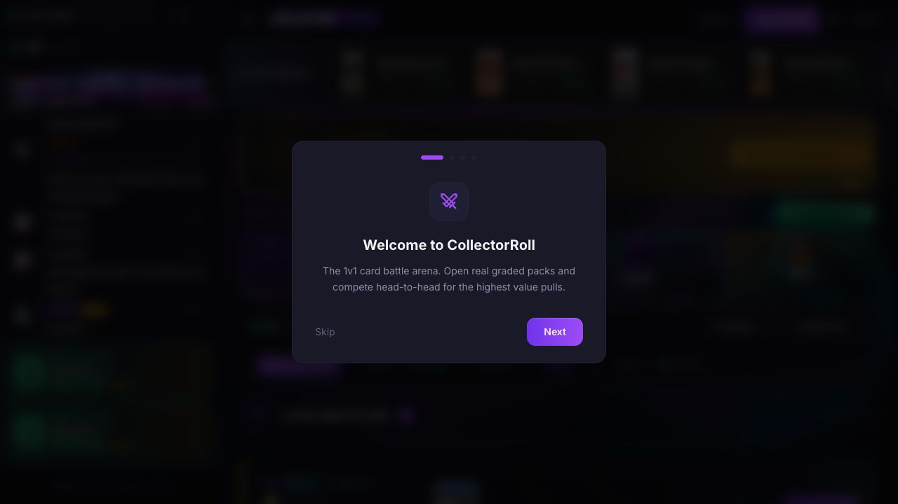
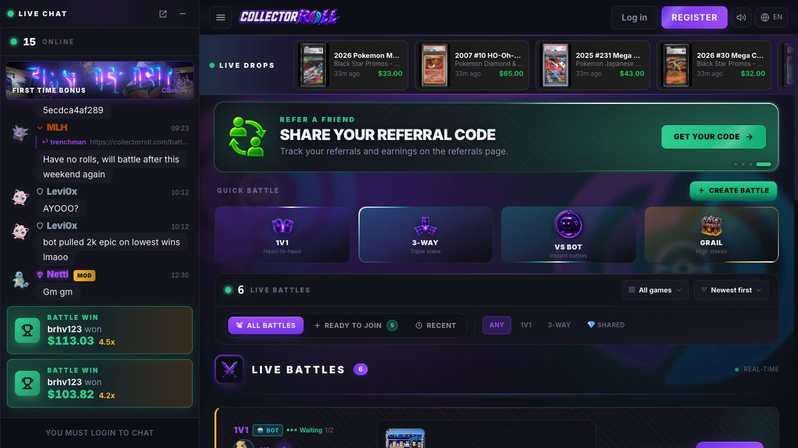
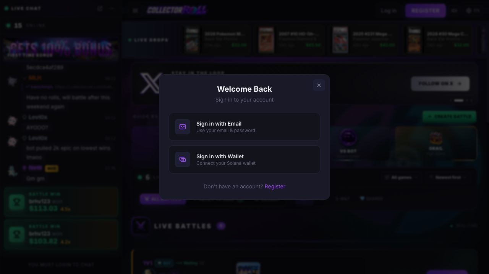
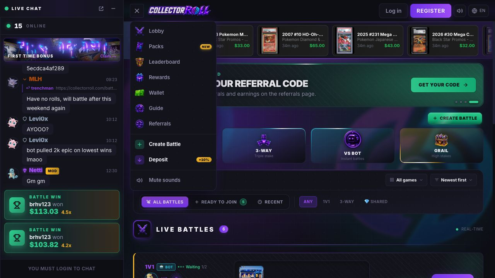
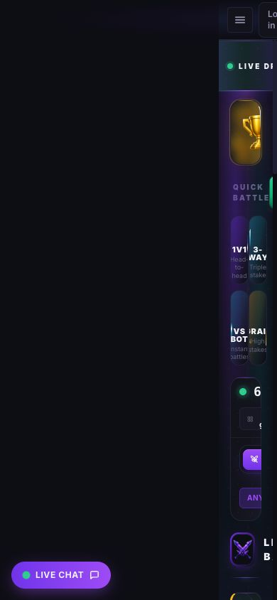
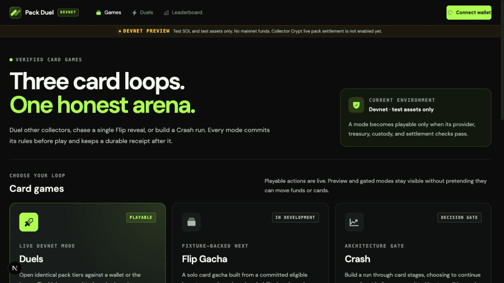
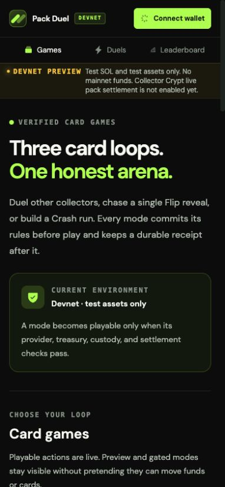

# CollectorRoll competitive audit

Captured on 2026-07-23 from the public, logged-out experience at
<https://collectorroll.com>.

## Scope

This is a combined UX and accessibility audit of the public onboarding, battle
lobby, game entry gate, navigation, and 390 × 844 responsive layout. It also
maps the strongest product patterns to Pack Duel's established Duels, Flip, and
Crash roadmap.

The user goal is to understand what makes CollectorRoll feel active and
compelling, then use the useful patterns without copying its visual identity or
claiming unbuilt capabilities.

## Step 1 — First-visit onboarding

**Health: good with avoidable friction.**

- The modal explains the core loop in one sentence and gives a clear primary
  action.
- It blocks the strongest proof of value—the live lobby—before the visitor has
  seen why the product is worth learning.
- `Skip` has visibly weak contrast and reads like disabled text.
- The progress indicator communicates a multi-step tour but does not name the
  number of steps or what will be covered.

Pack Duel should lead with the playable game lobby and make education
contextual. A short explanation belongs beside each mode, not in a blocking
tour.

## Step 2 — Public battle lobby

**Health: strong, dense, and immediately alive.**

- Live pulls, online chat, recent wins, open battles, bots, promotions, and
  rewards create multiple simultaneous signals that play is happening now.
- Quick Battle makes the game taxonomy scannable: 1v1, 3-way, bot, and
  high-stakes.
- Real values, player names, pack themes, seat counts, and waiting states reduce
  abstraction.
- The page is visually saturated. Promotions, chat, live drops, game modes,
  filters, and battle cards all compete for the first action.
- Several labels and values are very small and low contrast. This is a visible
  accessibility risk, but contrast ratios require code-level verification.
- Public chat exposes profanity and direct gambling-addiction language before
  login. The social proof is valuable, but moderation, age gating, and safer
  defaults need to be part of the product surface.

The transferable pattern is the activity-rich lobby, not the purple casino
skin. Pack Duel should surface real, verifiable activity and game availability
while keeping one dominant action per mode.

## Step 3 — Create-battle gate

**Health: clear but late.**

- Email and wallet sign-in choices are understandable and the modal is visually
  calm.
- Authentication appears only after the visitor chooses `Create Battle`, which
  lets people explore first.
- The click promises creation but delivers authentication. The gate should say
  that sign-in is the next step before the click.
- The close control is compact and may miss a comfortable touch target.
- Focus trapping, focus restoration, keyboard dismissal, and screen-reader
  announcement cannot be confirmed from screenshots alone.

Pack Duel should retain browse-before-connect behavior and state the wallet
requirement on the action itself.

## Step 4 — Product navigation

**Health: comprehensive but fragmented.**

- Lobby, Packs, Leaderboard, Rewards, Wallet, Guide, Referrals, battle creation,
  and deposit are all discoverable from one menu.
- `Packs — New` gives the solo gacha loop a clear home beside battles.
- Deposit is repeated as a promotional action while the core product taxonomy
  is split between Lobby and Packs.
- Icons are useful recognition aids, but similar neon styling makes the list
  harder to scan than its simple structure should be.

Pack Duel should organize the product around game modes first—Duels, Flip, and
Crash—then put history, receipts, leaderboard, and wallet support underneath
those loops.

## Step 5 — Mobile lobby at 390 × 844

**Health: broken.**

- The main application is translated mostly off-screen, leaving a large empty
  black region and only a narrow strip of content.
- Core lobby controls overlap and become unreadable.
- The chat launcher remains reachable, but the game task does not.
- The DOM still exposes the lobby content, so the failure appears to be visual
  positioning/reflow rather than content removal.

This is the clearest competitive opening: Pack Duel should treat 390px as a
first-class game surface and keep every primary game action reachable without
horizontal scrolling.

## Highest-impact product opportunities

1. **Create one honest games lobby.** Put Duels, Flip Gacha, and Crash in a
   single mobile-first surface. Only playable modes receive a value-bearing
   action.
2. **Show activity that can be verified.** Recent settled duels, public receipts,
   available tiers, and capability health are stronger trust signals than
   decorative “live” numbers.
3. **Use bots and house play to solve cold-start liquidity.** Surface Instant
   Duel only when treasury, provider, and exposure gates say it is playable.
4. **Make solo play the acquisition funnel.** Flip is the card-themed gacha loop:
   a committed inventory snapshot, probability band, acquisition, reveal, and
   ownership receipt.
5. **Make Crash a retention loop, not a generic multiplier clone.** Each Continue
   action should advance through real card outcomes under a versioned rule set;
   Cash Out and Bust must preserve the custody and settlement contract.
6. **Build social proof around durable outcomes.** Share cards, receipts,
   rematches, and leaderboards can create the “alive” feeling without exposing
   an unmoderated public chat as the first experience.
7. **Keep the product visibly devnet and fail closed.** CollectorRoll often
   presents value and action before explaining finality. Pack Duel can win trust
   by separating committed game state, card ownership, and settlement finality.

## Recommended game lineup

| Mode | Player promise | Current product truth | Lobby action |
| --- | --- | --- | --- |
| Duels | Two packs open; the higher verified card value wins | Existing devnet experience | Playable when capabilities pass |
| Flip Gacha | Buy one committed chance at a card from an eligible inventory pool | Fixture-backed roadmap; production blocked by commercial/provider approval | Preview only until promoted |
| Crash | Continue through card stages or cash out before the session busts | Architecture and live economics are not yet approved | Rules preview only |

## Pack Duel implementation checkpoint

The first competitive response is now implemented as a `/games` lobby. It
preserves the existing Pack Duel design system, gives the established three-mode
roadmap a clear home, and exposes a real action only for the currently playable
mode.

The same page was verified at a 390 × 844 CSS viewport. Its measured document
width is 382px with no horizontal overflow.

## Evidence limits

- The audit used the public logged-out flow only; no deposit, funded play,
  account, wallet, reward, referral, or settlement was executed.
- Keyboard traversal, focus management, semantic announcements, exact contrast,
  reduced-motion behavior, and assistive-technology output need implementation
  inspection or dedicated testing.
- The lobby changed live while it was captured. Counts, player messages, pulls,
  and promotion slides are point-in-time evidence.
